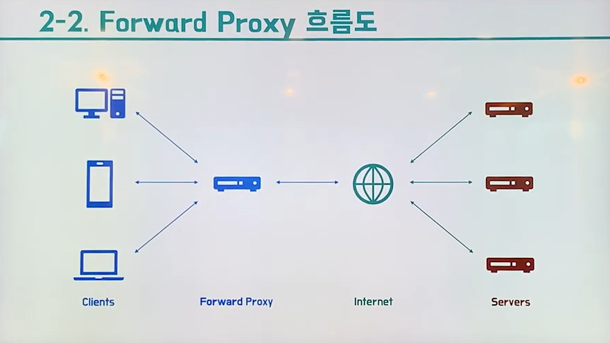
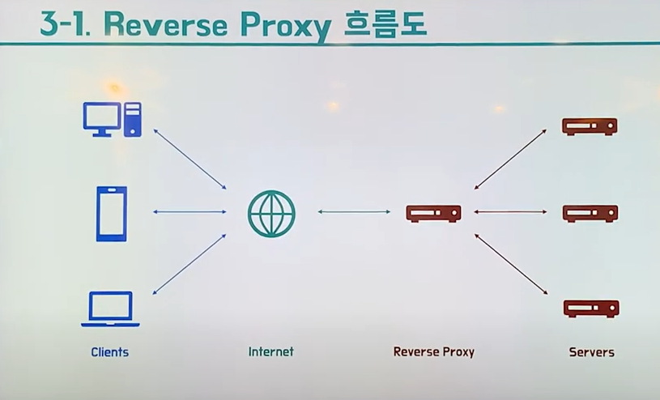
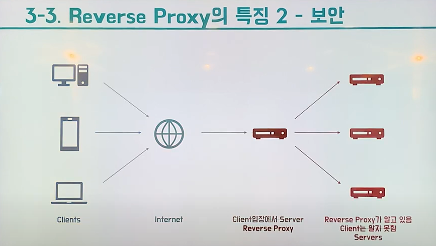
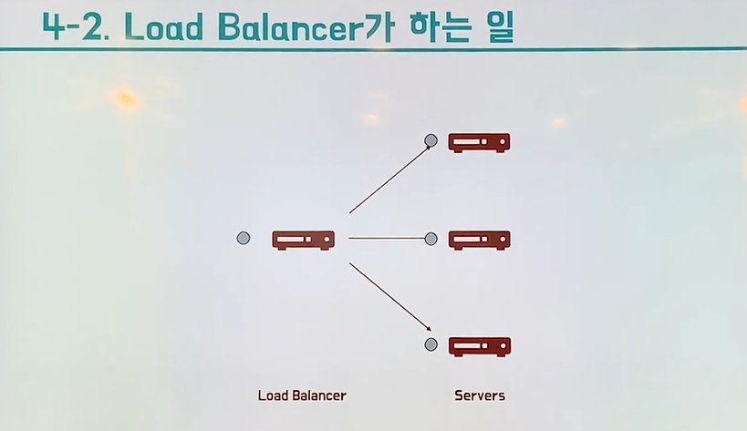

### 1. Proxy
##### 1.1 Proxy Server
- '대리'
- Proxy Server ? 대신 처리하는 서버
- 클라이언트와 서버간의 중계 서버로 통신을 대리 수행하는 서버
- 캐시 보안 트래픽 분산 등의 장점이 있음

### 2. Forward proxy
- 일반적인 프록시는 Forward Proxy 임

##### 2-1. Forward proxy 의 특징 1 - 캐싱
- 클라이언트가 요청한 내용을 캐싱
- (Q. 오늘 날씨 어때?) : 클라 -> FP -> Internet -> Server
- 클라 <- FP <- Internet <- Server (A. 비가 온다 )
- 이 때 FP 에서 해당 물음에 대한 답을 저장해둠 === 캐싱
- 다른 클라에서 동일한 질문 물었을 때 서버 거치지 않고 FP 에서 바로 응답 전달하여 전송시간 절약 및 불필요한 외부 전송 감소

##### 2-4. Forward proxy 의 특징 2 - 익명성
- 클라이언트가 보낸 요청을 감춤 (클라 IP 숨김 대신 FP IP로)
- 클라 -> FP -> Internet -> 서버 전달 시 클라에서 요청한 걸 FP에서 요청한 것처럼 FP의 정보 전달하여 요청 IP 는 FP IP가 됨

### 3. Reverse Proxy
- 인터넷과 서버 사이에 위치함

##### 3.1 Reverse Proxy 특징 1 - 캐싱
- 클라의 요청 내용을 캐싱 (FP와 동일)

##### 3.2 Reverse Proxy 특징 2 - 보안
- 서버정보를 클라로부터 숨길 수 있음 (서버 IP 숨김 대신 RP 로)
- 클라이언트는 요청할 떄 서버를 직접 알지 못하고, 클라의 입장에서 서버인 RP에 요청을 전달 -> RP 가 서버에 전달함
- 그래서 클라는 RP를 실제 서버라고 생각하고 요청하기 때문에 실제 서버들의 IP가 클라로부터 안전하게 보호됨

### Load Balancing
- 하는 경우도 있고 하지 않는 경우도 있음 (선택적)
- 부하분산: 해야할 작업을 나누어 서버의 부하를 분산시키는 것
- 서버들에게 요청을 나누어 분산시킴
- 여러 대의 서버가 분산 (나누어) 처리할 수 있도록 요청을 나누어주는 서비스
- 
