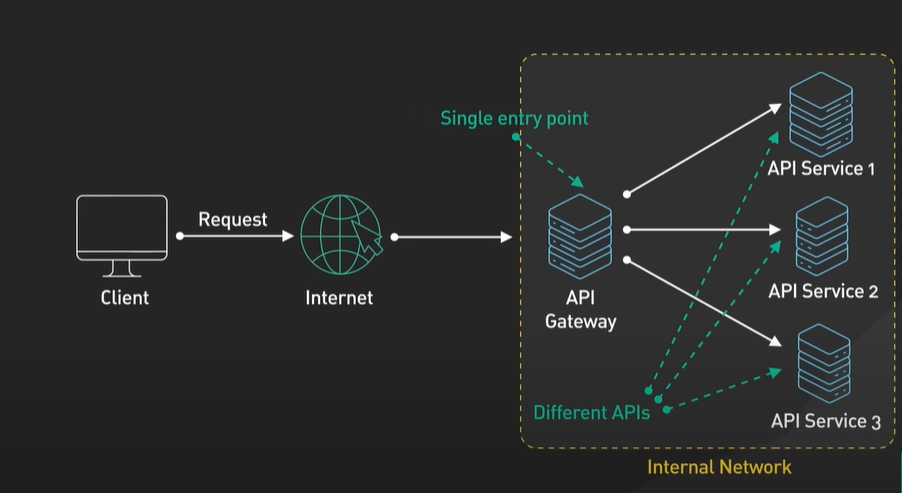

## 🔐API Gateway

<aside>
💡 요약하자면 IP 주소 및 사용자 인증을 거쳐서 요청해주는 기능인듯

</aside>

  

- 기능
    - 인증 및 보안 정책 강제
    - 로드 밸런싱 및 회로 차단
    - 프로토콜 변환 및 서비스 검색
    - 모니터링, 로깅, 분석 및 빌링
    - 캐싱
- 단계

  

    1. 클라이언트가 API 게이트웨이에 요청을 보낸다. 요청은 일반적으로 HTTP 기반이다.
    2. `Parameter Validation` API 게이트웨이가 HTTP 요청을 유효성 검사한다.
    3. `Allow-list/Deny-list` API 게이트웨이가 호출자의 IP 주소와 기타 HTTP 헤더를 허용 목록과 거부 목록과 비교한다. 또한 IP 주소 및 HTTP 헤더와 같은 속성에 대한 기본 속도 제한을 확인할 수 있다. ex) 특정 속도를 초과하는 IP 주소에서의 요청을 거부할 수 있다.
    4. `Authentication/ Authorization` API 게이트웨이가 인증 및 권한 부여를 위해 식별 공급자에 요청을 전달한다. API 게이트웨이는 요청이 허용된 작업 범위와 함께 인증된 세션을 공급자로부터 받는다.
    5. `Rate Limit` 인증된 세션에 대해 높은 수준의 속도 제한 검사가 적용된다. 제한을 초과하면 요청은 이 시점에서 거부된다.

  6-7. `Dynamic Routing` 서비스 검색 구성 요소의 도움으로 API 게이트웨이는 경로 일치 (path matching)에 따라 요청을 처리할 적절한 백엔드 서비스를 찾는다.

    1. API 게이트웨이가 요청을 적절한 프로토콜로 변환하고 변환된 요청을 백엔드 서비스에 전송한다. 백엔드 서비스로부터 응답이 도착하면 API 게이트웨이가 응답을 공개 프로토콜로 다시 변환하고 응답을 클라이언트에 반환한다. ex) gRPC

- API 게이트웨이는 다른 중요한 서비스도 제공한다.
    - 오버로딩으로부터 서비스를 보호하기 위해 오류를 추적하고 회로 차단 기능을 제공해야 한다.
    - 운영 가능성을 위해 로깅, 모니터링 및 분석 서비스를 제공해야 한다.

<aside>
❓ 로드 밸런싱의 기능을 하는 거면 로드 밸런서와의 차이가 뭐지?

</aside>

- 결론
    - API 게이트웨이는 인프라의 중요한 부분이다.
    - 가용성을 향상시키기 위해 여러 지역에 배포되어야 한다.
    - 많은 클라우드 제공 업체의 경우 API 게이트웨이가 클라이언트에 가까운 전 세계적으로 배치된다

## 🚦 Load Balancer

<aside>
💡 웹에서 발생하는 트래픽에 대해서 서버의 과부하가 발생하지 않도록 밸런스를 유지할 수 있도록 요청을 분배하는 역할을 함

</aside>

- 웹에서 발생하는 트래픽 > 로드 밸런서 > 서버
- 어떤 서버로 갈지 분배하는 역할을 함
- 이때 어떤 서버로 요청할지 어떻게 정하는지 대표적인 세 가지 시나리오 소개
    1. Round Robin
        - 요청 들어오는 순서대로 서버1, 서버2, 서버3, 서버4, 서버n, 다시 서버1, 2, … 이렇게 순서대로 일방적으로 요청함
        - 단점: 사람별로 요청하는 간격이 다르면 특정 서버에는 과부하가 올 수 있음
    2. Smart
        - LB 와 서버 간에 상호작용으로 결정함
    3. Random
        - 랜덤 알고리즘으로 서버로 요청함

### 📚 참고

[What is API Gateway?](https://www.youtube.com/watch?v=6ULyxuHKxg8&t=1s)
[What is a Load Balancer?](https://www.youtube.com/watch?v=sCR3SAVdyCc)